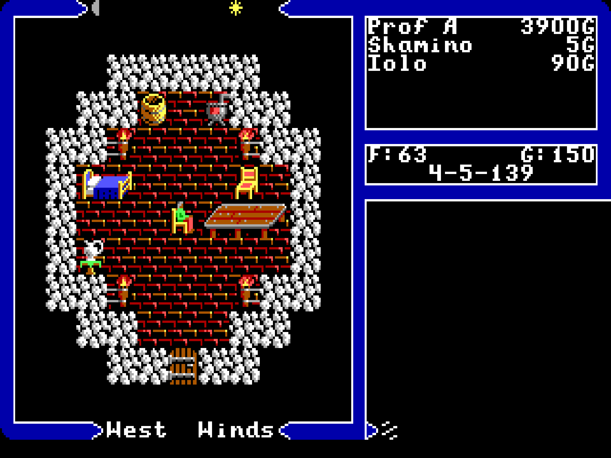

# CECS 378 Lab 2 - Malware

## Assignment Description
This assignment is designed to introduce to you how malware can infect compiled programs, give you exposure to using a hex editor to understand computer code at a machine level, and how security researchers inspect binary code to understand software at a low level.

I love playing video games. Some of my earliest memories of childhood was sitting in front of a computer playing computer games. I'd love to revisit some of my old favorites, but as a professor, I have very little time to actually sit down and play games these days.

So, I need your help. I want to play one of the all time great CRPGs, Ultima V, but I have no time to go through the grind of leveling up and maxing out my stats.

### Running the Game
The game will probably not run directly on modern operating systems, but it will run just fine under DOSBox (a DOS environment designed to play older games). Grab [DOSBox from here](http://www.dosbox.com). DOSBox will require a bit of setup, but the game should run under DOSBox without any additional tweaking of the game itself.

First, play the game enough to establish a character and get a feel for how the game is played. If you have experience playing CRPGs, then this game will be at least somewhat familiar to you. Then, you will save the game by pressing 'Q' and then alter the game's files to give your character maximum stats and gold. You can check the character's stats by pressing 'Z' and then selecting the highlighted character on the right. It will be up to you to locate which file(s) are necessary to modify and what values to place into those file(s) at specific locations.

Completing this assignment will require you to use a binary hex editor. I have listed a few here if you do not have one, but feel free to use whatever editor you choose:

|    OS    |    Program   |
|----------|--------------|
|  Windows |  [Fhred](https://github.com/datadiode/frhed) |
|  MacOS   |  [HexFiend](https://github.com/ridiculousfish/HexFiend/releases) |
|  Linux   |  [Bless](http://home.gna.org/bless)  |

The final stats on your *main character* (the one with your name) should look something like this:

|    Attribute    |    Value   |
|-----------------|------------|
|    STR          |     99     |
|    INT          |     99     |
|    DEX          |     99     |
|    HP           |     999    |
|    Max HP       |     999    |
|    EXP          |     9999   |
|    Gold         |     9999   |

### Assignment
Probably the most difficult part of this assignment is locating *where* in the game to make the modifications. I recommend spending a good amount of time figuring out how the internal structure of the game (in binary, of course) is organized. If you can discern a pattern from the binary placement, then this assignment will become much easier.

First, when you discover where something is located (the offset, in binary terms) write it down. You will need to turn in the offsets of each location and the file in which they were contained in to complete this assignment.

Next, once you've understood the structure of the program and how it is laid out, write a short program (in whatever language you like) which modifies the original game's binary files to replace the values above in the appropriate location. It should not be necessary to decompile the original code (and it would break the game anyways), but it will be necessary to do a little reading on how to edit a binary file inside of code (hint: read it in like a regular file and save it in its original form back to the file itself).

One last thought: remember in CECS 341 where you learned about big-endian and little-endian encoding? This might be important to know for this lab...

## Additional Requirements
For full credit on the assignment, I'm requiring some additional things to be added to your final program. If you've understood the first part, these should not be all that difficult to include:

* An interactive program which allows the user to change the values to whatever they want (not just a pre-set value structure).
* Include the following values in your alterations/offset listing/source code program:

* All of the above stats on *every* companion character (not just the main PC). There are sixteen total companion characters in the game.

  * 100 keys
  * 100 skull keys
  * 100 gems
  * 1 black badge
  * 2 magic carpets
  * 10 magic axes (the best weapon in the game!!)
  * And the ability to set all of these values within your interactive program by a user

Finally, give me a writeup on your experience doing this assignment, *the offsets and file(s) for all of the attributes that you changed*, and some screenshots of your p@wn3d game (bragging rights allowed).

All of the offsets should be listed in hex format (ie. `0xDEADBEEF`).

## Deliverables
Submit the following through Github Classroom:
* Your modified game files in a separate folder (*not the whole game*)
* Your source code that modifies the game, in its original format
* A screenshot of your modified stats in the game
* A short write-up of how you determined which files to alter, which location addresses (offsets) were modified, what values they were changed to, and what the end result was

Your submission must follow the following rules, else *I will not grade it and you will receive a zero for the submission*:

* Do not use compression on your files
* Make sure that all significant code is *commented* with your own explanations
